# Trisa's Shop - Laravel Multi-Vendor E-Commerce Project

This is a Laravel based multi-vendor e-commerce web application. The project includes public product browsing, customer ordering, cart management, online/offline payment options, product review moderation, seller store/product management, and an admin dashboard for managing the full system.

## Portfolio Links

| Type | Link |
| --- | --- |
| GitHub Profile | `https://github.com/Trisa-debnath` |
| Project Repository | `https://github.com/Trisa-debnath/Trisa-s_shop` |
| Video Demo | `https://drive.google.com/drive/folders/1ljScV0nsutvM3ZnjDWVZURHuQcj42GgN?usp=sharing` |
| LinkedIn | `https://www.linkedin.com/in/trisa-debnath-147249361` |
| Email | `trisha123nath321@gmail.com` |

## Project Overview

This project can be used to run an online marketplace where:

- Customers can browse products, search products, view product details, add items to cart, place orders, and submit reviews.
- Sellers/vendors can create stores, add products, manage their own products, and view order history.
- Admin can manage categories, subcategories, products, orders, discounts, product attributes, homepage settings, and reviews.

## Base Code Reference

The base code for this project was taken from my GitHub repository:

```text
https://github.com/Trisa-debnath/e-commerce
```

I customized and extended this base project to build the current Laravel multi-vendor e-commerce application.

## My Contribution

This project was designed and developed by me as a Laravel multi-vendor e-commerce application. I implemented the main modules, database structure, role based access, admin panel, seller panel, customer panel, cart, order, payment, review, and product management features.

Main work completed by me:

- Built role based authentication for admin, vendor/seller, and customer.
- Created admin dashboard with product, order, user, revenue, and payment statistics.
- Built product, category, subcategory, store, discount, attribute, order, and review management.
- Developed seller store and product management workflow.
- Added customer panel routes for profile, order history, payment, and affiliate pages.
- Implemented session based cart and checkout flow.
- Added Stripe card payment, Cash on Delivery, bKash, and Nagad payment options.
- Added multiple product image upload and Laravel storage support.
- Added order PDF download using DomPDF.
- Used Livewire for product search, cart interaction, category/subcategory selection, and homepage components.

## Why This Project Is Useful

This project shows practical Laravel development skills through a real e-commerce workflow. It includes authentication, authorization, CRUD operations, file upload, database relationships, payment integration, dashboard statistics, PDF generation, and user role management.

Interviewers can review this project to understand my ability to build a complete web application with Laravel, Blade, Livewire, Tailwind CSS, MySQL, and third-party package integration.

## Main Features

### Public Website

- Home page with latest products, slider products, and discounted products.
- Product category page.
- Product details page.
- Live product search using Livewire.
- Add to cart using session based cart.
- Checkout/order proceed page.
- Order success and order cancel pages.
- Product review submission.

### Customer Panel

- Customer dashboard/profile page route.
- Customer order history page route.
- Customer payment page route.
- Customer affiliate page route.
- Profile update, password update, and account delete options through Laravel Breeze profile features.

### Seller/Vendor Panel

- Vendor dashboard.
- Store create, manage, edit, update, and delete.
- Product create and manage.
- Multiple product image upload.
- Seller order history page with search.
- Seller order search.

### Admin Panel

- Admin dashboard with product, order, user, revenue, pending, completed, cancelled, paid order, recent order, and recent product statistics.
- Category create, manage, edit, update, and delete.
- Subcategory create, manage, edit, update, and delete.
- Product create, manage, edit, update, and delete.
- Product image upload and delete.
- Product SKU and slug generation.
- Product stock, visibility, status, tax, SEO title, and SEO description management.
- Product discount create, manage, edit, update, and remove.
- Default product attribute create, manage, edit, update, and delete.
- Store and user management placeholder pages.
- Order history, order edit, order update, order delete, and order search.
- Order PDF download using DomPDF.
- Product review approve/reject system.
- Homepage setting update.

### Payment Features

- Cash on Delivery.
- bKash payment information collection.
- Nagad payment information collection.
- Stripe card payment integration.
- Payment status and transaction ID storing.

### Role Based Access

The project uses role based routing:

| Role | Value | Access |
| --- | ---: | --- |
| Admin | `0` | Admin dashboard and management modules |
| Vendor/Seller | `1` | Seller dashboard, store, product, and order history page |
| Customer | `2` | Customer dashboard/profile, order history, payment, and affiliate routes |

## Demo Login Setup

For a portfolio demo, the project includes seeded users for admin, vendor/seller, and customer login.

| Role | Email | Password |
| --- | --- | --- |
| Admin | `admin@gmail.com` | `password` |
| Vendor/Seller | `eti@gmail.com` | `password` |
| Customer | `trisha@gmail.com` | `password` |

Required role values:

- Admin: `0`
- Vendor/Seller: `1`
- Customer: `2`

Run the database seeder to create these accounts:

```bash
php artisan db:seed
```

These accounts should be tested before recording the demo video or sharing the live project link.

## Technology Stack

- Laravel 12
- PHP 8.2+
- Laravel Breeze authentication
- Livewire 3
- MySQL or any Laravel supported database
- Stripe PHP SDK
- DomPDF for order PDF generation
- Tailwind CSS
- Alpine.js
- Vite

## Important Packages

Composer packages:

- `laravel/framework`
- `laravel/breeze`
- `livewire/livewire`
- `stripe/stripe-php`
- `barryvdh/laravel-dompdf`

NPM packages:

- `vite`
- `tailwindcss`
- `alpinejs`
- `axios`
- `concurrently`
- `laravel-vite-plugin`

## Project Structure

```text
app/
  Http/Controllers/
    Admin/
    Customer/
    Seller/
  Livewire/
  Models/
database/
  migrations/
public/
  admin_asset/
  home_asset/
resources/
  views/
    admin/
    auth/
    customer/
    home/
    livewire/
    seller/
routes/
  web.php
  auth.php
```

## Main Routes

### Public Routes

- `/` - Home page
- `/category/{category_name}` - Category wise product page
- `/viewdetails/{id}` - Product details
- `/order/proceed` - Checkout/order proceed
- `/order/store` - Store order
- `/order/success` - Order success
- `/order/cancel` - Order cancel

### Admin Routes

- `/admin/dashboard`
- `/admin/category/create`
- `/admin/category/manage`
- `/admin/subcategory/create`
- `/admin/subcategory/manage`
- `/admin/product/create`
- `/admin/product/manage`
- `/admin/product/review/manage`
- `/admin/discount/create`
- `/admin/discount/manage`
- `/admin/order/history`
- `/admin/manage/users`
- `/admin/manage/stores`
- `/admin/seeting`

### Vendor Routes

- `/vendor/dashboard`
- `/vendor/store/create`
- `/vendor/store/manage`
- `/vendor/product/create`
- `/vendor/product/manage`
- `/vendor/orderhistory`

### Customer Routes

- `/user/dashboard`
- `/user/order/history`
- `/user/setting/payment`
- `/user/affiliate`

## Installation Guide

### 1. Clone The Project

```bash
git clone https://github.com/Trisa-debnath/Trisa-s_shop.git
cd Trisa-s_shop
```

### 2. Install PHP Dependencies

```bash
composer install
```

### 3. Install Node Dependencies

```bash
npm install
```

### 4. Create Environment File

```bash
cp .env.example .env
```

If `.env.example` is not available, create `.env` manually and add the required database, app, mail, and payment credentials.

### 5. Generate App Key

```bash
php artisan key:generate
```

### 6. Configure Database

Update these values in `.env`:

```env
DB_CONNECTION=mysql
DB_HOST=127.0.0.1
DB_PORT=3306
DB_DATABASE=trisa-shop
DB_USERNAME=root
DB_PASSWORD=
```

### 7. Configure Payment Values

Add payment information in `.env`:

```env
STRIPE_KEY=stripe_public_key_here
STRIPE_SECRET=stripe_secret_key_here
BKASH_PAYMENT_NUMBER=01XXXXXXXXX
NAGAD_PAYMENT_NUMBER=01XXXXXXXXX
```

### 8. Run Migration

```bash
php artisan migrate
```

### 9. Seed Demo Users

```bash
php artisan db:seed
```

### 10. Create Storage Link

```bash
php artisan storage:link
```

### 11. Start Development Server

Run Laravel and Vite separately:

```bash
php artisan serve
npm run dev
```

Or run the combined development command:

```bash
composer run dev
```

Then open:

```text
http://127.0.0.1:8000
```

## Test Command

```bash
php artisan test
```

1.  a folder named `docs/screenshots` in the project root.

2.  simple file names 
   - `home-page.png`
   - `product-details.png`
   - `cart-page.png`
   - `checkout-page.png`
   - `admin-dashboard.png`
   - `seller-dashboard.png`
   - `customer-dashboard.png`
4. Add some screenshot here:

```md
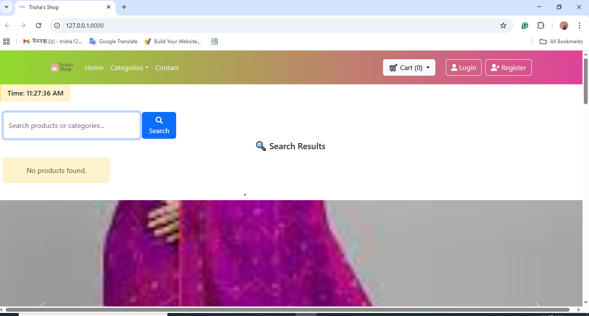
```


## Project Screenshots

Project screenshots are stored in `docs/screenshots/`.

### Home Page


### Discount Products

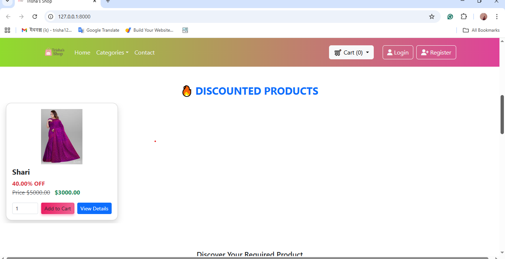

### Category Products

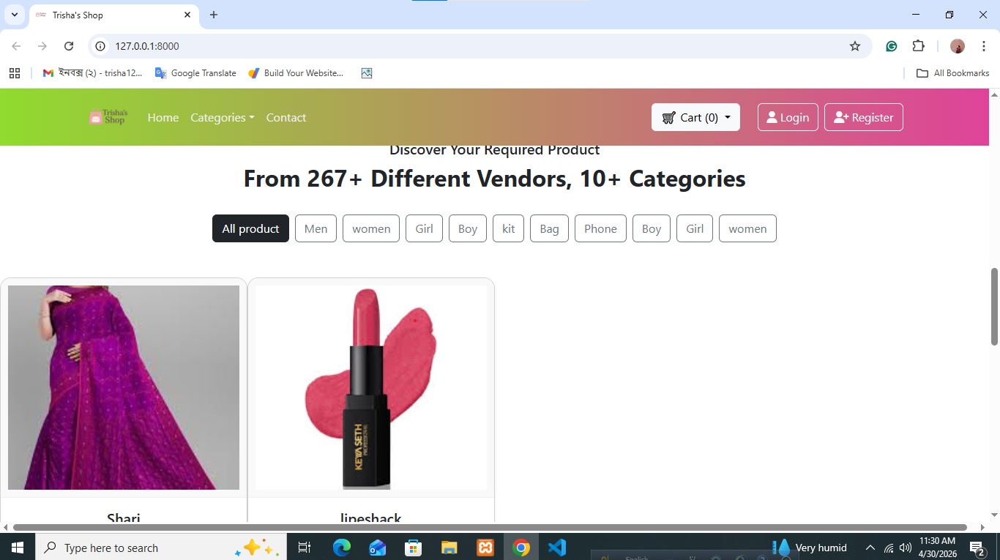

### Product Details

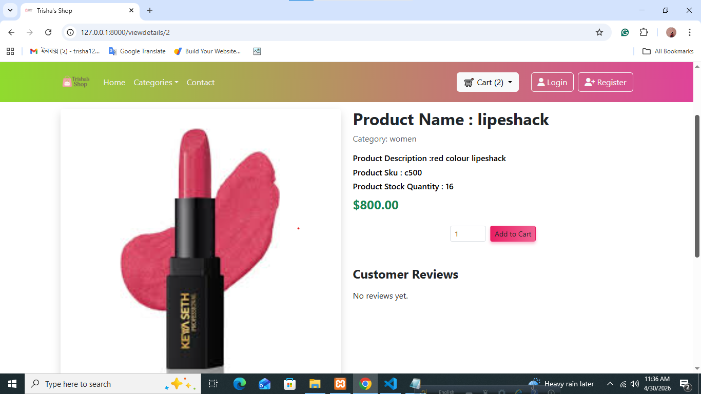

### Add To Cart


### Cart / Checkout


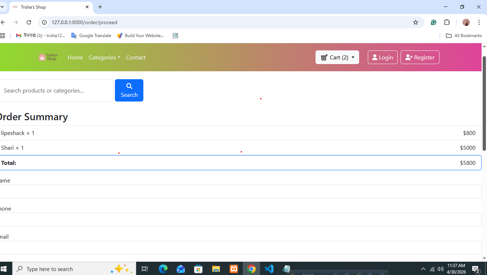
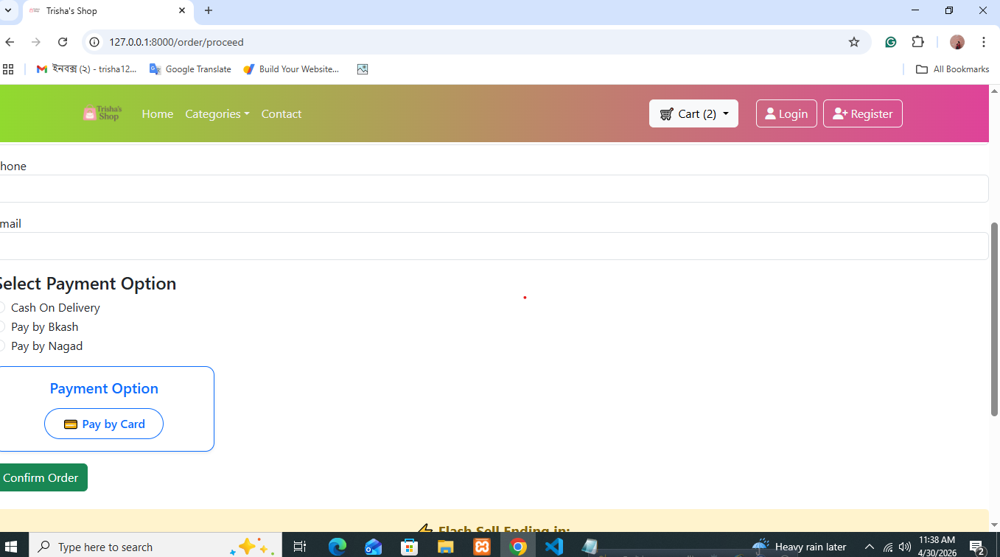

### Payment Options

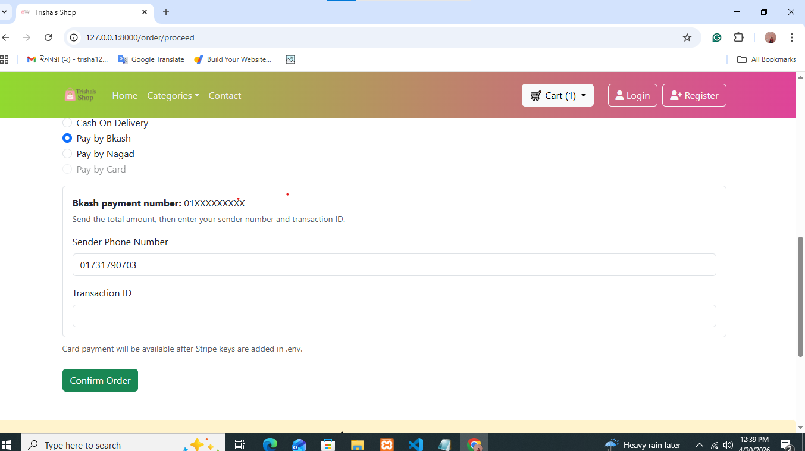
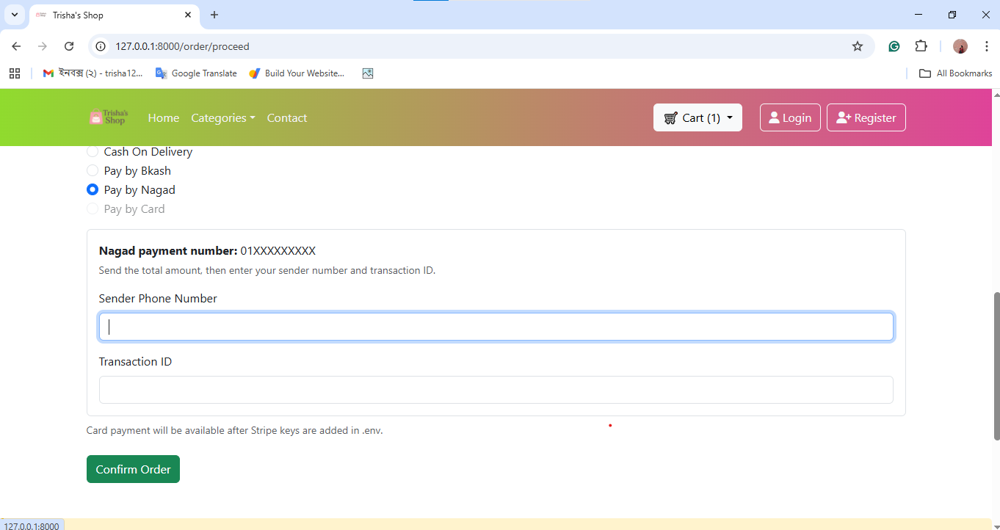


### Admin Dashboard

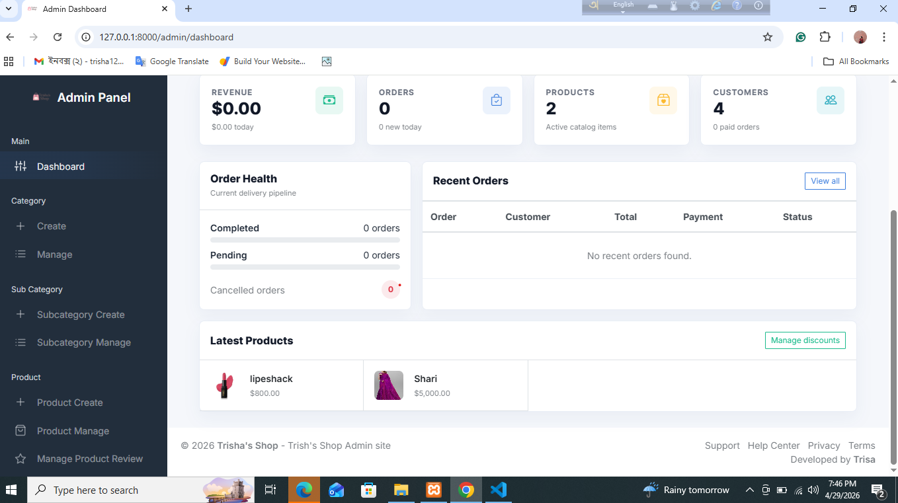

### Admin Category Manage

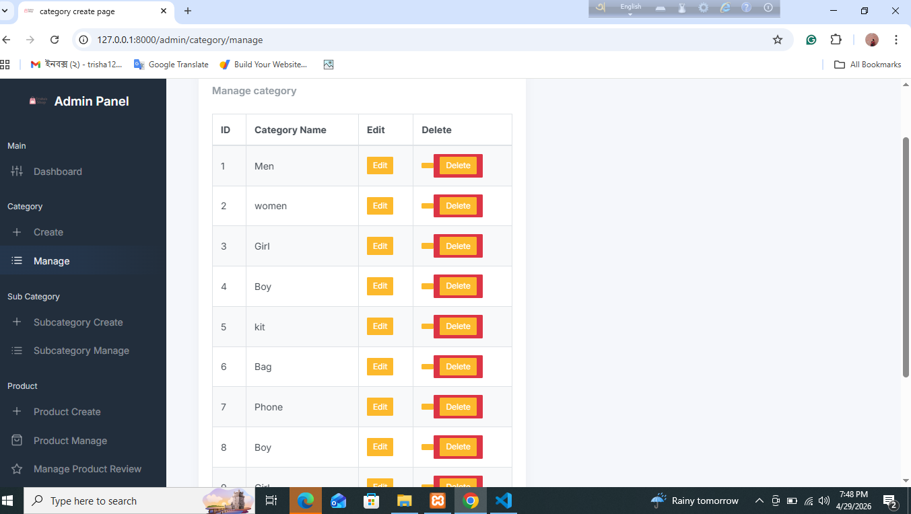

### Admin Product Create

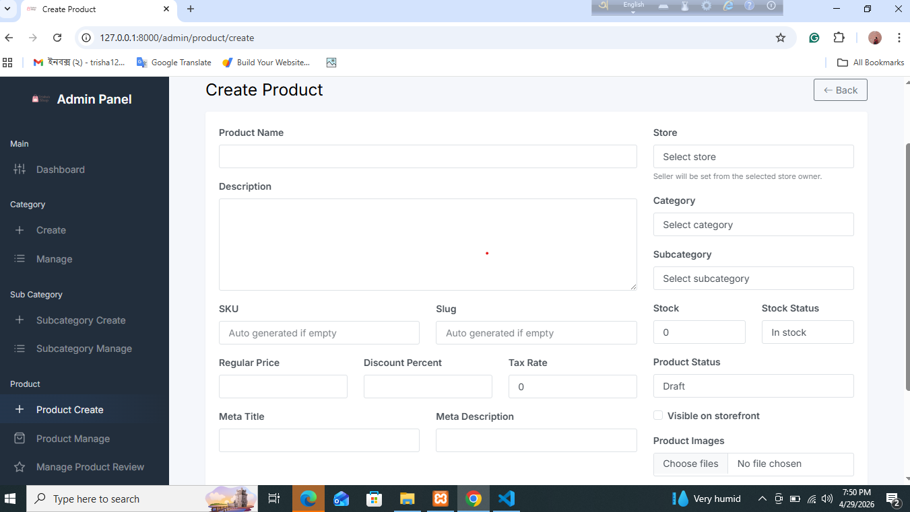

### Admin Product Manage

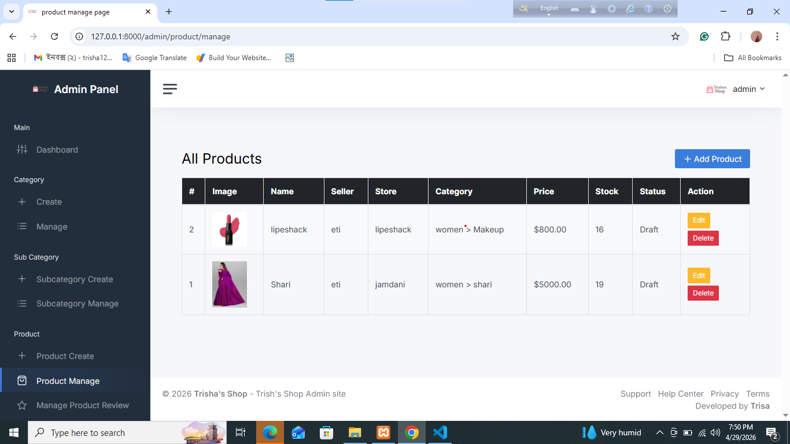

### Admin Discount Manage

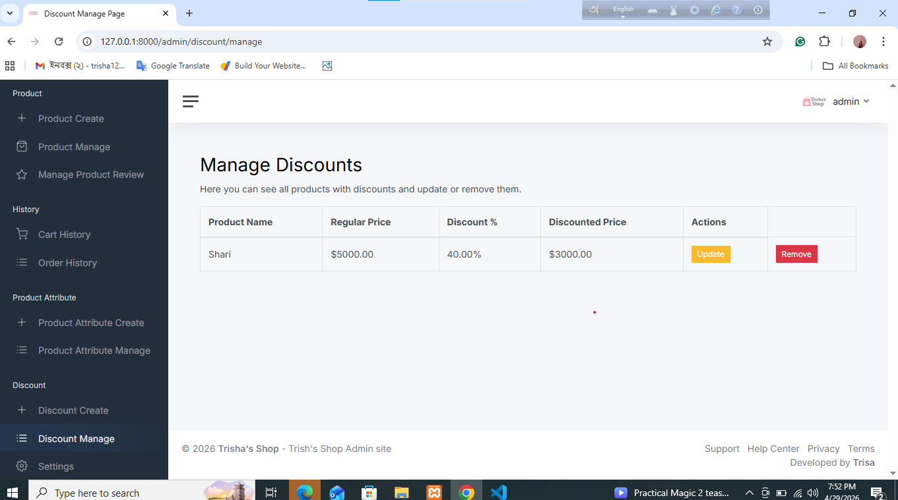

### Admin Review Manage

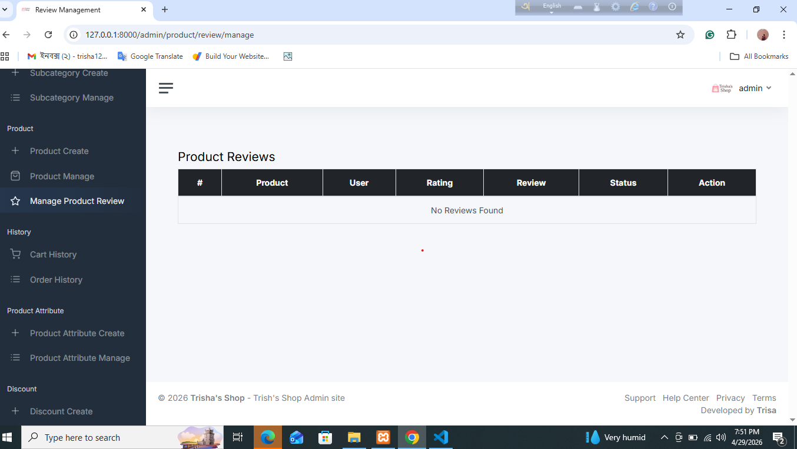

### Admin Homepage Setting

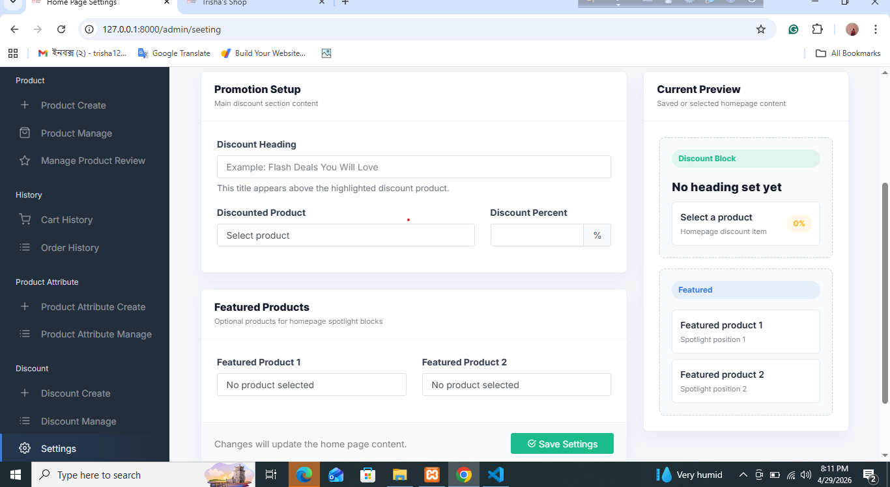

### Seller Dashboard

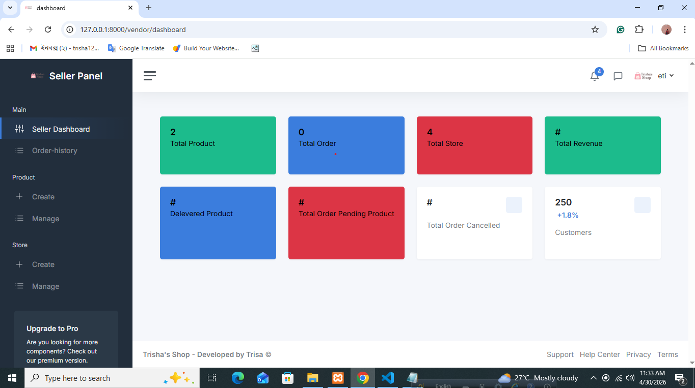


## Useful Notes

- Product images are stored in Laravel public storage, so `php artisan storage:link` is required.
- Admin, vendor, and customer access depends on the `role` value in the `users` table.
- bKash and Nagad payment numbers are read from `.env`.
- Product reviews are submitted first, then admin can approve or reject them.

## Future Improvement Ideas

- Add payment verification for bKash/Nagad.
- Add product wishlist.

## Author

Developed by:

```text
Trisa Debnath
Laravel / PHP Developer
GitHub: https://github.com/Trisa-debnath
LinkedIn: https://www.linkedin.com/in/trisa-debnath-147249361
Email: trisha123nath321@gmail.com
```
